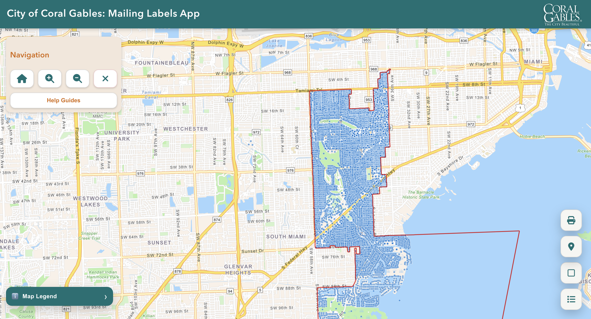
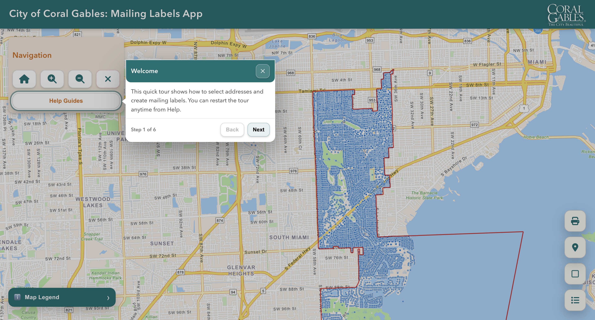
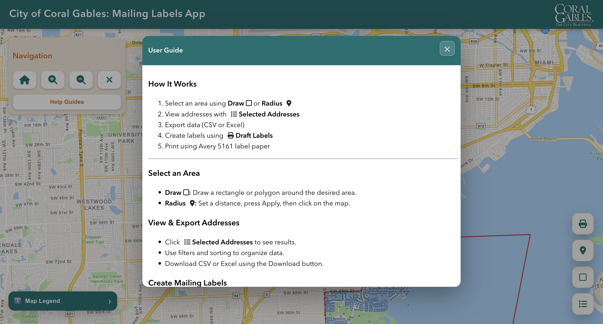
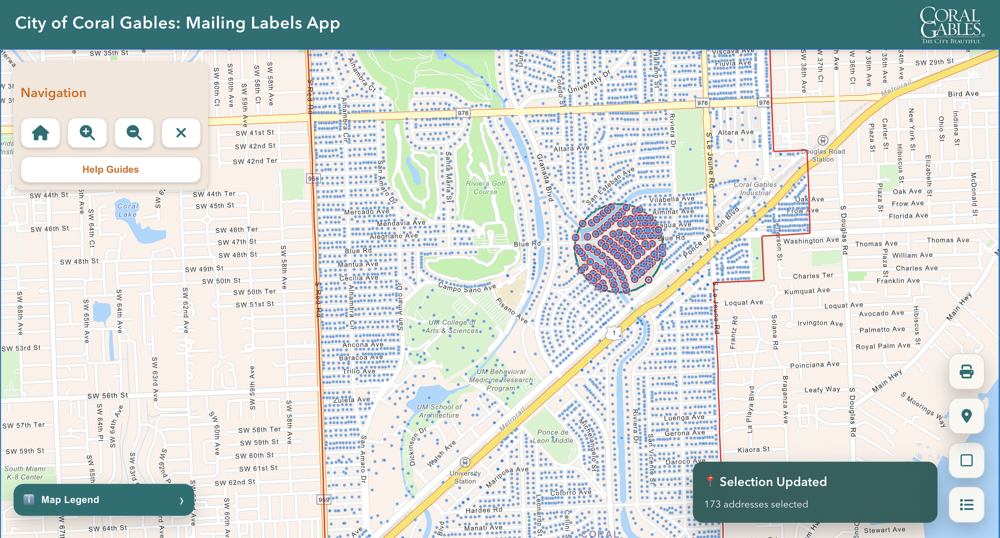
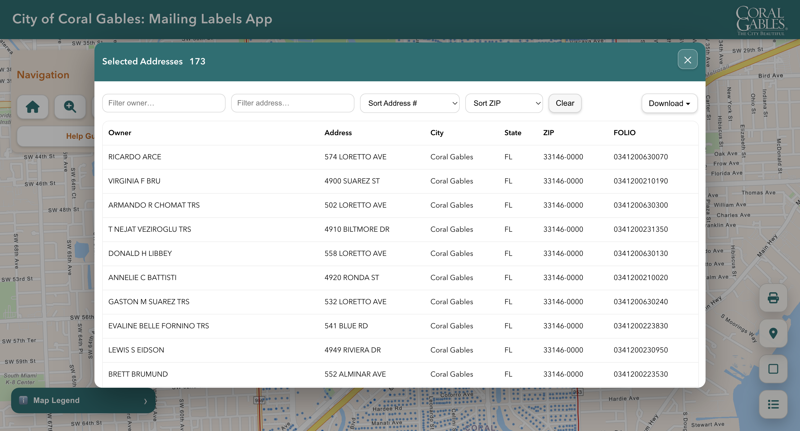
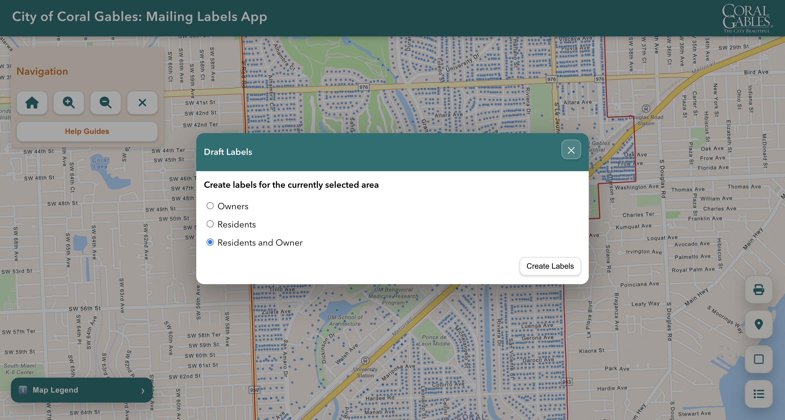
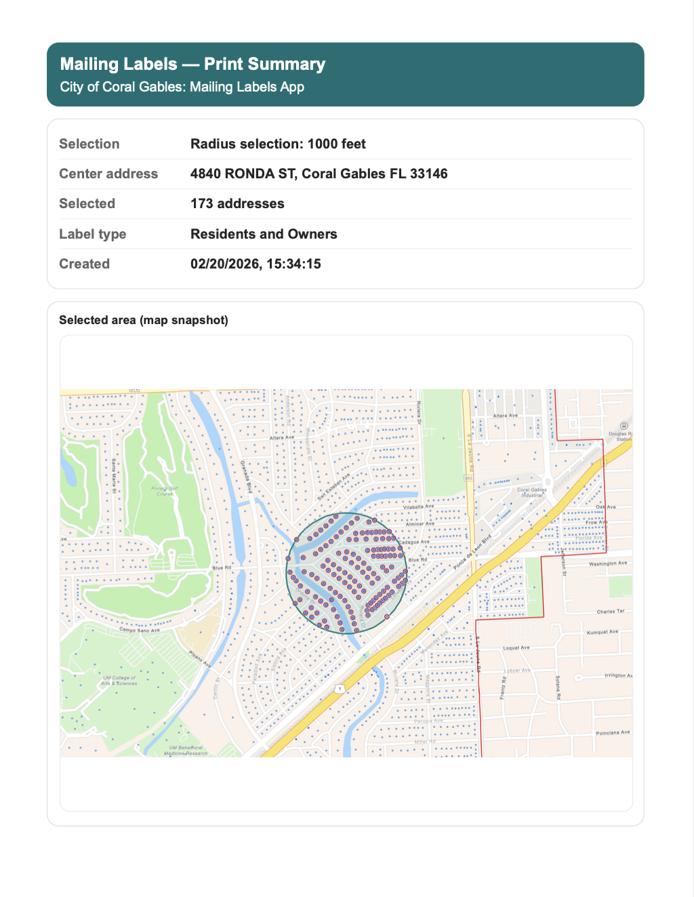
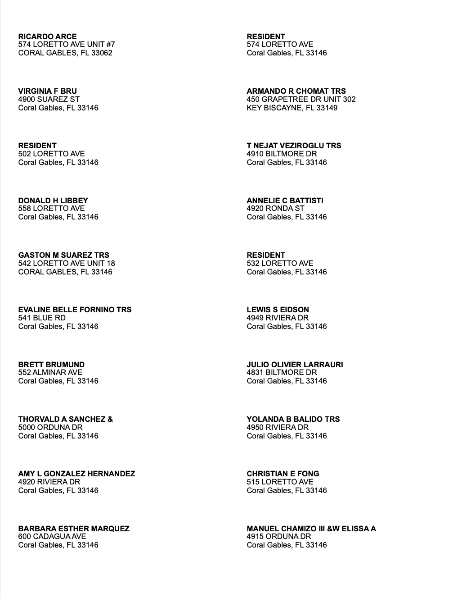

# City of Coral Gables — Mailing Labels GIS App

Web-based GIS application for selecting properties by area or radius, exporting address data, and generating **Avery 5161 mailing labels**.

Built using:

- ArcGIS JavaScript API  
- HTML  
- CSS  
- JavaScript  
- Developed in Visual Studio Code  

Designed specifically for **City of Coral Gables workflows**.

---

## Overview

This interactive mapping application allows users to:

- Select properties using draw tools or radius selection
- View and filter selected addresses
- Export selected data to CSV or Excel
- Generate printable Avery 5161 mailing labels
- Produce a print-ready summary page including a map snapshot

---

## Application Screens

### 1. Main Page — Map View

Interactive ArcGIS map centered on Coral Gables with navigation tools and selection options.



---

### 2. Quick Tour Guide

Step-by-step guided walkthrough explaining how to use the application.



---

### 3. User Guide

Detailed instructions explaining selection methods, exporting, and label generation.



---

### 4. Radius Selection Example

Users can zoom into an area and select properties by setting a distance radius.



---

### 5. Selected Addresses Panel

After making a selection, users can:

- Filter results
- Sort addresses
- Download CSV or Excel files



---

### 6. Draft Labels Options

Users can choose:

- Owners
- Residents
- Residents and Owners

Then generate Avery 5161 labels.



---

### 7–8. Print Output Example

Page 1 — Print Summary  
Includes:
- Selection method  
- Center address  
- Number of addresses  
- Label type  
- Map snapshot  



Page 2+ — Avery 5161 Labels  
Formatted for 2 columns × 10 rows per page.



---

## Features

- Draw (rectangle/polygon) selection  
- Radius-based selection  
- Real-time selection count  
- Data filtering and sorting  
- CSV and Excel export  
- Print-ready Avery 5161 formatting  
- Automatic map snapshot generation  
- Professional UI with guided help system  

---

## Project Structure

```
/project-root
│
├── index.html
├── style.css
├── script.js
├── /assets
└── /screenshots
```

---

## How to Run

1. Clone the repository  
2. Open `index.html` in your browser  

Or deploy using GitHub Pages.

---

## Notes

- This application was created specifically for the Coral Gables area.
- Uses ArcGIS JavaScript API for spatial querying and map rendering.
- Designed for municipal mailing label workflows.

---

## Author

Created for City of Coral Gables GIS workflow support.
